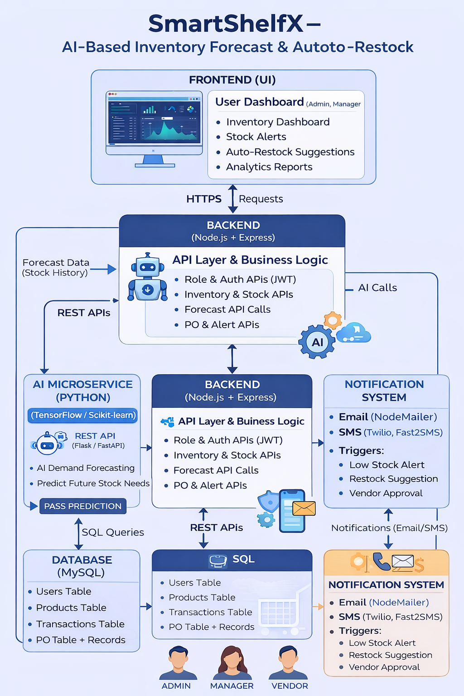
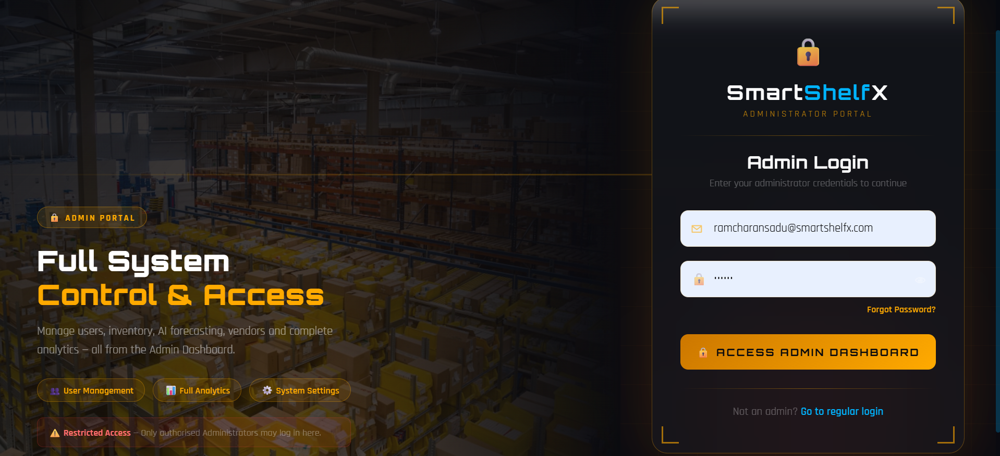
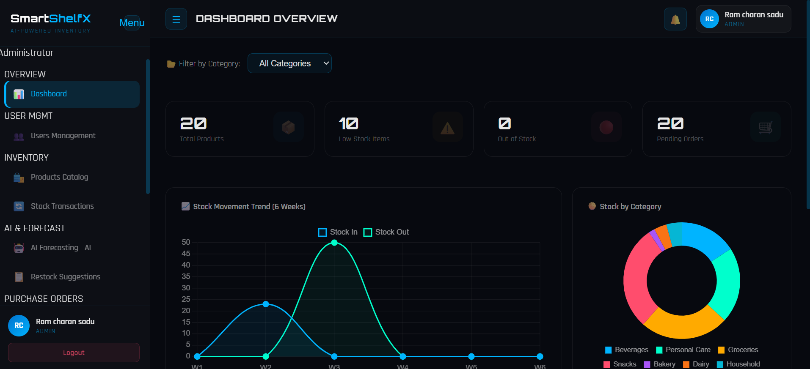
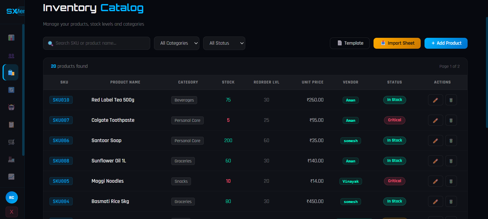
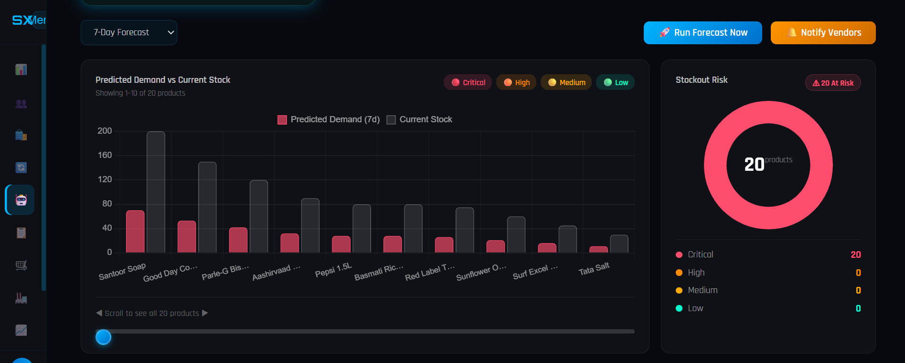

# 🛒 SmartShelfX – AI-Powered Inventory Management & Demand Forecasting System

[](https://angular.io/)
[](https://nodejs.org/)
[](https://expressjs.com/)
[](https://sequelize.org/)
[](https://python.org/)
[](https://scikit-learn.org/)
[](https://opensource.org/licenses/MIT)

> **SmartShelfX** is an enterprise-grade, full-stack AI-driven inventory management and procurement optimization platform. It bridges real-time warehouse tracking with predictive machine learning demand forecasting, automated purchase order generation, vendor alert pipelines, and role-based multi-tier access control.

---

## 🌐 Live Deployment & Demo

| Service | Deployment Platform | Status & Live URL |
| :--- | :--- | :--- |
| **Backend API** | Render Cloud | [](https://smartshelfx-h9co.onrender.com/api/health) [`https://smartshelfx-h9co.onrender.com`](https://smartshelfx-h9co.onrender.com/api/health) |
| **API Health Check** | Render Cloud | [`GET /api/health`](https://smartshelfx-h9co.onrender.com/api/health) |
| **GitHub Repository** | GitHub | [`ramcharansadu46-bit/SmartShelfx`](https://github.com/ramcharansadu46-bit/SmartShelfx) |

---

## ⚡ Demo Credentials

SmartShelfX features one-click demo logins on the sign-in page for instant evaluation:

| Role | Email | Password | Access Privileges |
| :--- | :--- | :--- | :--- |
| 👑 **Administrator** | `admin@smartshelfx.com` | `Admin@123` | Full system control, inventory CRUD, user management, system metrics |
| 💼 **Manager** | `manager@smartshelfx.com` | `Admin@123` | Inventory operations, AI forecast execution, purchase order approvals |
| 🚚 **Vendor (Dairy)** | `vendor.dairy@smartshelfx.com` | `Admin@123` | Purchase order fulfillment, stock delivery status, restock alerts |
| 🚚 **Vendor (Groceries)** | `vendor.groceries@smartshelfx.com` | `Admin@123` | Purchase order fulfillment, stock delivery status, restock alerts |

---

## 🚀 Key Features

* **🤖 AI Demand Forecasting**: Multi-horizon predictive modeling analyzing historical sales velocity, product consumption rates, and seasonality to predict demand up to 30 days ahead with confidence scoring.
* **🚨 Smart Warehouse Alerts**: Automated event-driven triggers for `LOW_STOCK`, `OUT_OF_STOCK`, and `RESTOCK_SUGGESTED` states.
* **📋 Purchase Order Automation**: Zero-touch auto-generation of purchase orders when stock levels hit critical reorder thresholds, routed directly to assigned vendors.
* **📊 Real-Time Analytics**: Visual KPI cards, transaction distribution bar charts, category breakdown donut charts, and order status tracking.
* **👥 Role-Based Access Control (RBAC)**: Fine-grained security permissions separating **Admin**, **Manager**, and **Vendor** workflows.
* **🔄 Fault-Tolerant Hybrid Architecture**: Zero-downtime database strategy supporting MySQL in development and zero-config persistent SQLite on containerized cloud deployments, with automated seed pipelines.

---

## 🧠 Tech Stack

```
SmartShelfX
├── Frontend:    Angular 19 (Standalone Components, Signals, RxJS, Chart.js, SCSS)
├── Backend:     Node.js + Express.js (REST API, JWT Authentication, Nodemailer)
├── ORM & DB:    Sequelize ORM (MySQL / SQLite with automated migrations & seeding)
└── ML Engine:   Python FastAPI/Flask (Pandas, NumPy, Scikit-learn Linear Regression)
```

---

## 🏗️ System Architecture



### Data & Execution Flow
1. **Inventory Telemetry**: Stock intakes and outbound sales transactions are recorded via the REST API.
2. **AI Demand Engine**: The forecasting engine analyzes sales velocity across 60-day historical transaction batches.
3. **Automated Risk Triage**: Items at `HIGH` or `CRITICAL` stockout risk trigger automated restock alerts.
4. **Procurement Pipeline**: Purchase orders are automatically generated and linked to designated vendors with real-time status transitions (`PENDING` ➔ `APPROVED` ➔ `DISPATCHED` ➔ `DELIVERED`).

---

## 📸 Application Showcase

### 🔐 Authentication & Role Portal


### 📊 Real-Time Analytics Dashboard


### 📦 Inventory Management


### 🤖 AI Demand Forecasting


---

## ⚙️ Installation & Local Setup

### Prerequisites
- **Node.js**: v18.x or higher
- **npm**: v9.x or higher
- **Python**: v3.10+ (optional, for ML microservice)
- **MySQL**: v8.0+ (optional; automatically falls back to SQLite)

### 1. Clone the Repository
```bash
git clone https://github.com/ramcharansadu46-bit/SmartShelfx.git
cd SmartShelfx
```

### 2. Backend Setup
```bash
cd backend
npm install
npm start
```
*Backend runs on `http://localhost:3000` (auto-seeds demo users and 22 inventory products).*

### 3. Frontend Setup
```bash
cd ../frontend
npm install
npm start
```
*Frontend runs on `http://localhost:4200`.*

### 4. ML Microservice (Optional)
```bash
cd ../ml-service
python -m venv venv
venv\Scripts\activate   # On Linux/macOS: source venv/bin/activate
pip install -r requirements.txt
uvicorn main:app --reload --port 8000
```

---

## 📡 REST API Reference Summary

| Method | Endpoint | Description | Auth Required |
| :--- | :--- | :--- | :--- |
| `POST` | `/api/auth/login` | Authenticate user & return JWT token | No |
| `GET` | `/api/health` | Service & database connectivity health | No |
| `GET` | `/api/products` | Retrieve paginated inventory products | Yes |
| `POST` | `/api/products` | Add new product SKU to inventory | Admin/Manager |
| `GET` | `/api/analytics/summary` | Retrieve KPI metrics & category statistics | Yes |
| `GET` | `/api/analytics/velocity` | Daily sales velocity per product (ML input) | Yes |
| `GET` | `/api/forecast` | Retrieve latest demand predictions | Yes |
| `POST` | `/api/forecast/run` | Execute AI demand forecasting model | Admin/Manager |
| `GET` | `/api/alerts` | Query active warehouse stock alerts | Yes |
| `GET` | `/api/orders` | Retrieve purchase orders (filtered by role) | Yes |
| `PATCH` | `/api/orders/:id/status` | Update purchase order lifecycle state | Yes |

---

## 👨‍💻 Author

**Ramcharan Sadu**
- **GitHub**: [@ramcharansadu46-bit](https://github.com/ramcharansadu46-bit)
- **Project**: SmartShelfX – AI-Powered Inventory Management System
